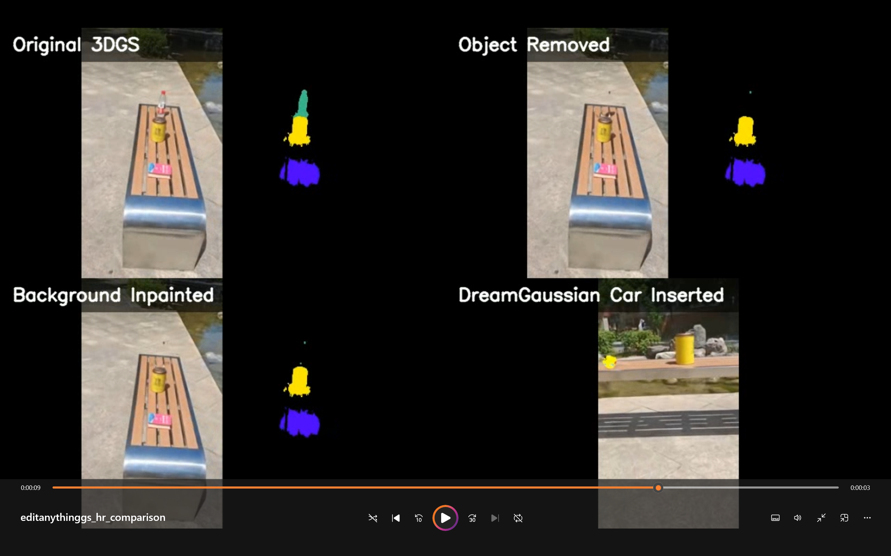

# EditAnythingGS

EditAnythingGS is a reproducible 3D Gaussian Splatting scene-editing pipeline
for a custom tabletop scene. It connects scene reconstruction, object-aware
mask supervision, object removal, 3D inpainting, generated object insertion,
and RGB preview rendering into one end-to-end workflow.

The project is built as an engineering integration around several open-source
research systems, especially Inpaint360GS and DreamGaussian. My contribution is
the reproducible workflow, custom-scene data organization, SAM2 mask adaptation,
DreamGaussian PLY insertion tools, command templates, and experiment notes that
make the whole editing process easier to repeat on a real captured scene.

## Highlights

- Reconstruct a custom tabletop scene with 3D Gaussian Splatting.
- Use manually prompted SAM2 masks as high-quality object supervision.
- Convert external masks into the object-mask format required by the editing
  pipeline.
- Distill 2D object masks into 3D Gaussian object features.
- Remove a selected object from the 3DGS scene.
- Inpaint missing RGB/depth content and fuse the result back into 3D Gaussians.
- Generate a new object with DreamGaussian and insert the object PLY into the
  edited scene.
- Render RGB-only preview videos for merged Gaussian scenes.

## Pipeline

```text
custom image sequence
  -> COLMAP camera reconstruction
  -> vanilla 3DGS training
  -> SAM2 object masks
  -> mask format conversion
  -> object feature distillation
  -> target object removal
  -> virtual RGB/depth/mask rendering
  -> LaMa RGB/depth inpainting
  -> fused inpainted PLY
  -> local 3DGS inpainting optimization
  -> DreamGaussian object PLY
  -> object transform and scene merge
  -> RGB preview rendering
```

## Repository Layout

```text
EditAnythingGS/
  README.md
  docs/
    DATA.md
    REPRODUCE.md
    THIRD_PARTY.md
    environment_notes_zh.md
    workflow_zh.md
  examples/
    commands/
      dreamgaussian_insert.sh
      inpaint360_custom_scene.sh
  scripts/
    00_prepare_workspace.sh
    01_copy_tools_to_inpaint360gs.sh
    02_reproduce_table_scene.sh
    03_insert_dreamgaussian_object.sh
    README.md
  tools/
    convert_sam2_masks.py
    create_fused_mask_ply.py
    insert_dreamgaussian_at_object.py
    insert_dreamgaussian_object.py
    print_object_bbox.py
    render_rgb_model.py
  weights/
    README.md
```

## What Is Included

This repository contains my bridge scripts, reproducibility documentation, and
command templates. The full upstream repositories, third-party checkpoints, and
heavy training outputs are intentionally not treated as original project code.

Tracked project-specific tools:

- `tools/convert_sam2_masks.py`: convert per-object SAM2 masks into instance
  masks and `scene.json`.
- `tools/insert_dreamgaussian_object.py`: transform and merge a DreamGaussian
  Gaussian PLY into an edited scene PLY.
- `tools/insert_dreamgaussian_at_object.py`: experimental object placement by
  object-feature bounding box.
- `tools/render_rgb_model.py`: render RGB previews without loading a semantic
  classifier.
- `tools/create_fused_mask_ply.py`: helper for fused inpainted point clouds.
- `tools/print_object_bbox.py`: inspect object-feature bounding boxes.

## Installation Overview

This project uses multiple upstream systems with different dependency stacks.
Do not install everything into a single Python environment. A practical setup is:

```text
inpaint360gs   -> Inpaint360GS, object distillation, scene editing, rendering
lama           -> LaMa RGB/depth inpainting
dreamgaussian  -> DreamGaussian object generation
```

See:

- [docs/REPRODUCE.md](docs/REPRODUCE.md) for the full reproduction workflow.
- [docs/DATA.md](docs/DATA.md) for dataset placement and expected layout.
- [docs/RESULTS.md](docs/RESULTS.md) for expected output paths and sanity
  checks.
- [weights/README.md](weights/README.md) for checkpoint placement.
- [docs/THIRD_PARTY.md](docs/THIRD_PARTY.md) for upstream project and license
  notes.

## Quick Start

The scripts under `scripts/` are templates. Set the environment variables to
your local upstream repository paths before running them.

```bash
export EDITANYTHINGGS_ROOT=/path/to/EditAnythingGS
export INPAINT360GS_ROOT=/path/to/Inpaint360GS
export DREAMGAUSSIAN_ROOT=/path/to/dreamgaussian
export SCENE_NAME=video2_table
export DATASET_NAME=mydata
export RESOLUTION=4

bash scripts/00_prepare_workspace.sh
bash scripts/01_copy_tools_to_inpaint360gs.sh
bash scripts/02_reproduce_table_scene.sh
bash scripts/03_insert_dreamgaussian_object.sh
```

For the exact step-by-step explanation, read
[docs/REPRODUCE.md](docs/REPRODUCE.md).

## Reproducing the Tabletop Editing Result

The reference experiment uses a custom tabletop image sequence and manually
prompted SAM2 masks for objects such as a dictionary, a water bottle, and a tea
can. The main result demonstrates:

1. original scene reconstruction,
2. target object removal,
3. background inpainting,
4. insertion of a generated yellow toy-car object,
5. RGB preview rendering of the edited scene.

Heavy data, checkpoints, trained Gaussian PLY files, and rendered videos should
be distributed through Releases, cloud storage, or Hugging Face rather than the
main Git history. See [docs/DATA.md](docs/DATA.md) and
[weights/README.md](weights/README.md). Expected output paths and point-count
sanity checks are documented in [docs/RESULTS.md](docs/RESULTS.md).

Reference dataset download:
[Google Drive](https://drive.google.com/drive/folders/1p9jbg28zGjfWnzGB-hka7sY-CYfn9VWL?usp=sharing).

## Results



## Running on Your Own Scene

To adapt the workflow to another scene:

1. Capture a multi-view image sequence.
2. Run COLMAP / 3DGS preprocessing in the upstream Inpaint360GS working tree.
3. Generate object masks with SAM2 or another high-quality mask source.
4. Convert masks with `tools/convert_sam2_masks.py`.
5. Run object-feature distillation.
6. Remove the target object and run inpainting.
7. Generate or prepare an external object PLY.
8. Insert the object with `tools/insert_dreamgaussian_object.py`.
9. Render the merged scene with `tools/render_rgb_model.py`.

## Project Scope and Attribution

EditAnythingGS is not a reimplementation of Inpaint360GS or DreamGaussian from
scratch. It is a reproducible project that integrates and adapts those systems
for a custom scene-editing task.

Please cite and follow the licenses of the upstream projects used in your
environment. See [docs/THIRD_PARTY.md](docs/THIRD_PARTY.md).

## License

The project-specific glue code and documentation in this repository are
released under the MIT License. Third-party repositories, pretrained weights,
datasets, and generated assets remain subject to their own licenses and usage
terms.

## Limitations

- Placement of generated objects currently depends on explicit scale,
  translation, and rotation parameters.
- Mask quality strongly affects object removal and inpainting quality.
- RGB/depth inpainting may introduce multi-view inconsistency or boundary
  artifacts.
- The full workflow is not real-time; training, inpainting, and object
  generation are separate stages.

## Future Work

- Add automatic object placement from depth, object masks, or user-selected
  anchor points.
- Add quality checks for masks, fused point clouds, and inserted-object scale.
- Package a smaller public demo scene and expected output checksums.
- Add a single orchestration script after all local paths and checkpoints are
  standardized.
